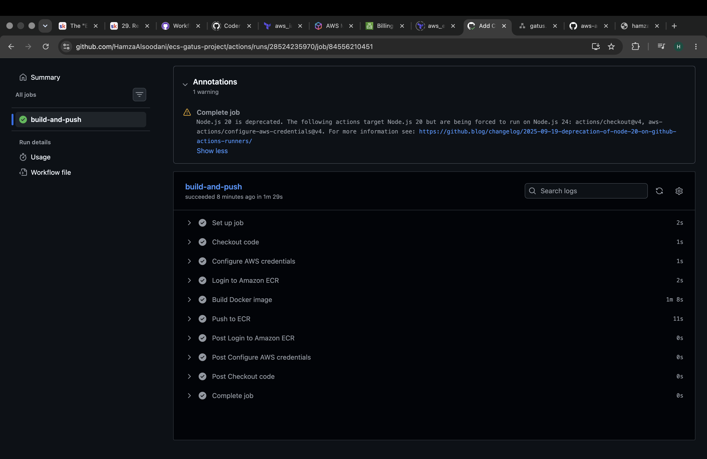
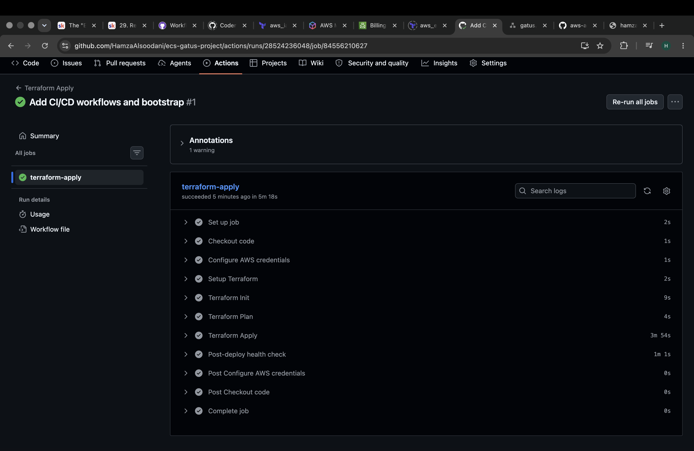
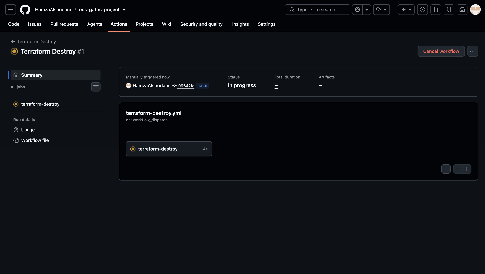

# Gatus Health Monitoring on AWS ECS Fargate

A health monitoring platform deployed on AWS using Terraform, Docker, and GitHub Actions. This project was built as part of a cloud infrastructure assignment, with the goal of deploying a containerised application to AWS using industry-standard practices.


---

## Live Demo


| Endpoint | URL |
|----------|-----|
| Monitoring Dashboard | https://tm.hamza-alsoodani.com |
| Main Website | https://hamza-alsoodani.com |

---

## What is Gatus?

[Gatus](https://github.com/TwiN/gatus) is an open-source health monitoring tool that checks the availability and performance of endpoints in real time. It gives you a clean status page showing whether your services are up or down.

For this project, I configured Gatus to monitor my own deployed domains, SSL certificate expiry, DNS resolution, and the ECR registry.

---

## Architecture


```
User
 │
 ▼
Route53 (DNS)  ──────────────────────────────────┐
 │                                                │
 ▼                                            ACM Certificate
Application Load Balancer (public subnets)       │
 │         ←─────────────────────────────────────┘
 ▼
ECS Fargate Task (private subnets)  ←── ECR (container image)
 │
 ▼
NAT Gateway (outbound only)
 │
 ▼
Internet (ECR pulls, health checks)
```

Requests come in through Route53, hit the ALB in the public subnets, and are forwarded to the Gatus container running in the private subnets. The ECS task has no public IP — outbound traffic (such as pulling the image from ECR) goes through a NAT Gateway.

---

## Design Decisions

### Private subnets for ECS
I placed the ECS tasks in private subnets rather than public ones. This means the container cannot be reached directly from the internet — all traffic must go through the ALB. This is a common pattern in production AWS environments.

### Custom multistage Dockerfile
Instead of using the official Gatus Docker image, I wrote my own multistage Dockerfile:

- **Stage 1:** Uses `golang:1.26-alpine` to compile the Go source code into a static binary
- **Stage 2:** Uses `scratch` — a completely empty base image — and copies in only the compiled binary

This keeps the final image very small and removes anything that isn't needed at runtime.

### Non-root container user
The container runs as user `65532:65532` rather than root. This is a basic container security practice that limits what an attacker could do if the container was compromised.

### OIDC instead of stored AWS keys
GitHub Actions authenticates to AWS using OpenID Connect. Each workflow run gets a short-lived token that expires when the run ends. This avoids storing permanent AWS credentials in GitHub Secrets.

### Modular Terraform
The infrastructure is split into separate modules — `vpc`, `ecr`, `alb`, `ecs`, `acm` — each handling one part of the stack. The root `main.tf` wires them together by passing outputs between modules.

### Remote state with S3
Terraform state is stored in an S3 bucket. This means both local runs and CI/CD pipeline runs share the same state file, which is essential for the destroy pipeline to work correctly.

---

## Repository Structure

```
ecs-gatus-project/
├── .github/
│   └── workflows/
│       ├── build-push.yml        # Builds and pushes Docker image to ECR
│       ├── terraform-apply.yml   # Provisions AWS infrastructure
│       └── terraform-destroy.yml # Tears down all AWS resources
├── app/
│   ├── Dockerfile                # Custom multistage build (golang → scratch)
│   ├── config.yaml               # Gatus endpoint configuration
│   ├── main.go                   # Gatus entrypoint
│   └── go.mod / go.sum           # Go dependencies
├── bootstrap/
│   ├── main.tf                   # OIDC provider and GitHub Actions IAM role
│   └── provider.tf               # AWS provider for bootstrap
├── infra/
│   ├── main.tf                   # Root module wiring all modules together
│   ├── provider.tf               # AWS provider configuration
│   ├── backend.tf                # S3 remote state configuration
│   ├── variables.tf              # Input variables
│   └── modules/
│       ├── vpc/                  # VPC, subnets, IGW, NAT Gateway, route tables
│       ├── ecr/                  # Container registry
│       ├── alb/                  # Load balancer, listeners, target group
│       ├── ecs/                  # Cluster, task definition, IAM, Fargate service
│       └── acm/                  # TLS certificate and DNS validation
└── README.md
```

---

## CI/CD Pipelines

There are three separate GitHub Actions workflows. Each one is scoped to only run when relevant files change.

### Build and Push
Triggers on push to `main` when `app/` files change. Builds the Docker image for `linux/amd64` (required for Fargate), tags it with both `latest` and the commit SHA, and pushes to ECR.



### Terraform Apply
Triggers on push to `main` when `infra/` files change, and can also be run manually. After applying, it waits 60 seconds and runs a health check against the live endpoint — the pipeline fails if the app is unreachable.



### Terraform Destroy
Manual trigger only. Requires typing `yes` as a confirmation before anything is deleted. Also scales the ECS service to zero before destroying to avoid the cluster getting stuck.



---

## Technologies Used

| Tool | Purpose |
|------|---------|
| AWS ECS Fargate | Runs the containerised application |
| AWS ECR | Stores the Docker image |
| AWS ALB | Handles incoming traffic and TLS termination |
| AWS ACM | Manages the HTTPS certificate |
| AWS Route53 | DNS routing for both domains |
| AWS CloudWatch | Collects container logs |
| AWS S3 | Stores Terraform remote state |
| Terraform | Provisions all AWS infrastructure |
| Docker | Builds the container image |
| GitHub Actions | Automates builds and deployments |

---

## Challenges

**ARM vs AMD64** — My Mac uses Apple Silicon (ARM) but Fargate runs on AMD64. The image built fine locally but failed silently on ECS. Fixed by adding `--platform linux/amd64` to the Docker build command.

**ACM certificate deadlock** — When I updated the certificate to cover both domains, Terraform tried to delete the old cert before creating the new one. ACM won't delete a cert that's in use by an ALB listener, so it hung indefinitely. Fixed by adding `lifecycle { create_before_destroy = true }` to the certificate resource.

**ECS in private subnets** — After moving ECS to private subnets, tasks couldn't pull images from ECR. This required adding a NAT Gateway, a separate private route table pointing to it, and setting `assign_public_ip = false` on the service. Each piece is required.

**Terraform state in CI/CD** — The pipeline ran `terraform apply` and stored state on the runner, which was deleted when the run ended. Running `terraform destroy` afterwards found nothing to destroy. Fixed by adding an S3 backend so state persists between pipeline runs.

**ECS cluster stuck on destroy** — The cluster wouldn't delete because the Fargate task was still running. Fixed by adding a step in the destroy workflow that scales the service to zero and waits 30 seconds before Terraform runs.
